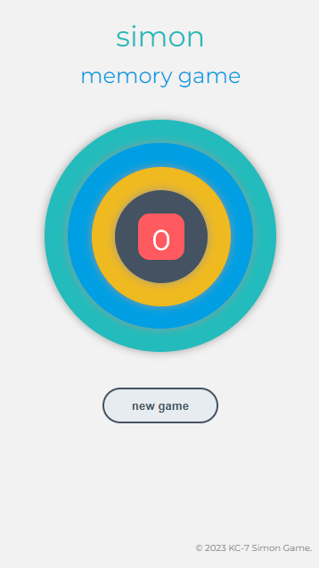
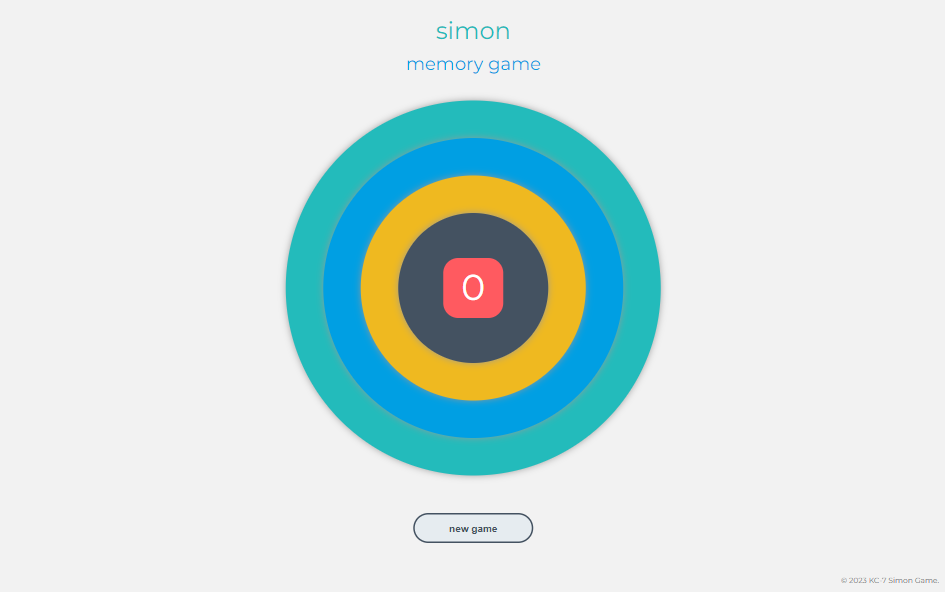

# Jest Simon Game

A "Simon" game built with JS and utilising Jest to test same. The game is based on the classic memory game in which the user needs to follow the pattern of lights and sounds made by the computer. 

[Live Link Here](https://kc-7.github.io/jest-simon-game/)

## Technologies Used

The game was implemented using HTML, CSS, JavaScript & Jest.

## Jest Tests

The tests check if the keys in the game object are correct and if the functions of the game work correctly. The tests also check the gameplay of the game to ensure the game works as expected.

### Const Tests
The tests are done to check if the game object contains the correct keys. The test checks if the score, currentGame, playerMoves, choices, turnNumber, lastButton and turnInProgress keys exists in the game object.

### Function Tests
The function tests are done to check the newGame function. The tests check if the game score is set to zero, if the computer's game array is of length 1, if the player's move array is cleared, and if the score displayed on the HTML is 0. It also checks if the class is added to the light up the buttons.

### Gameplay Tests
The gameplay tests are done to check the correctness of the game. The tests check if the game score is incremented if the turn is correct, if an alert is called if the move is wrong, if the turnInProgress is toggled to true, and if the score is not incremented if the player clicks during the computer's turn.

## Design

### Mobile

### Desktop

## How to Run Server in Gitpod

To run a frontend (HTML, CSS, Javascript only) application in Gitpod:

1. In the terminal, type: `python3 -m http.server`

2. A blue button should appear to click: ___Make Public___

3. Another blue button should appear to click: ___Open Browser___

## How to install Jest

To install Jest:

1. Type `npm init` into the terminal. 

2. Use default settings for all except **test command**, type `jest` here.

3. When the package.json file has been installed, type `npm install --save-dev jest`

Note, a previous version of Jest was installed in this project, I did this by entering the following for step 3. `npm install --save-dev jest@26.6.3`

## How to Run the Tests

To run the tests in Gitpod, in the terminal, type:

`npm test`

## Credits

I learned the information in this project through the Code Institute. 
